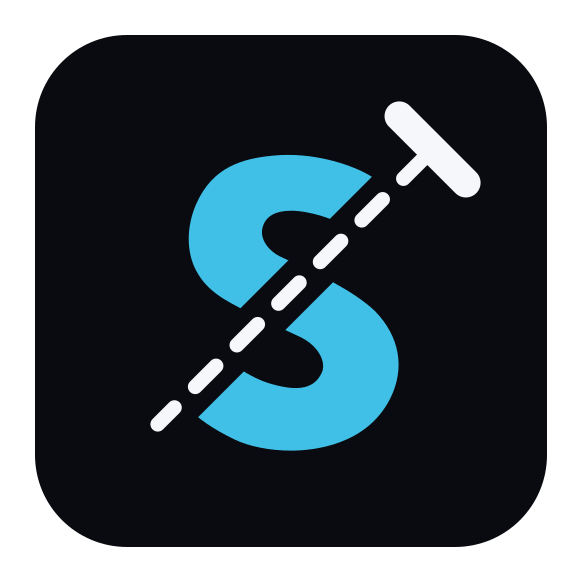
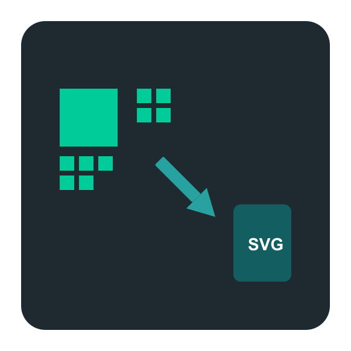

<!-- **AmanLakhuja/AmanLakhuja** is a ✨ _special_ ✨ repository because its `README.md` (this file) appears on your GitHub profile. -->

# 💫 About Me:

<a href="https://example.com">
  

</a>

---
# Projects

    
  

(Click on the Project Icon To visit there LIVE Version)

### Project Repositories

* [SplitTexter](https://github.com/AmanLakhuja/SplitTexter)
* [Hover-Debug-Overlay-Extension](https://github.com/AmanLakhuja/Hover-Debug-Overlay-Extension)
* [QR-Image-to-SVG](https://github.com/AmanLakhuja/QR-Image-to-SVG)

---

## 🌐 Socials:

---

# 💻 Tech Stack:

 

 
 
 
 
 
 
 

 
 

 
 
 
 

---

# 📊 GitHub Stats:
  
  
  

---

